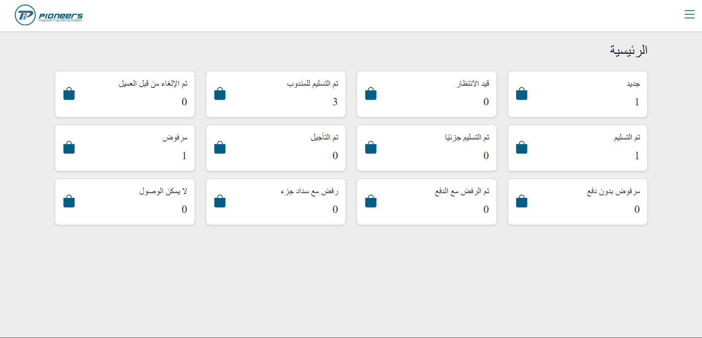
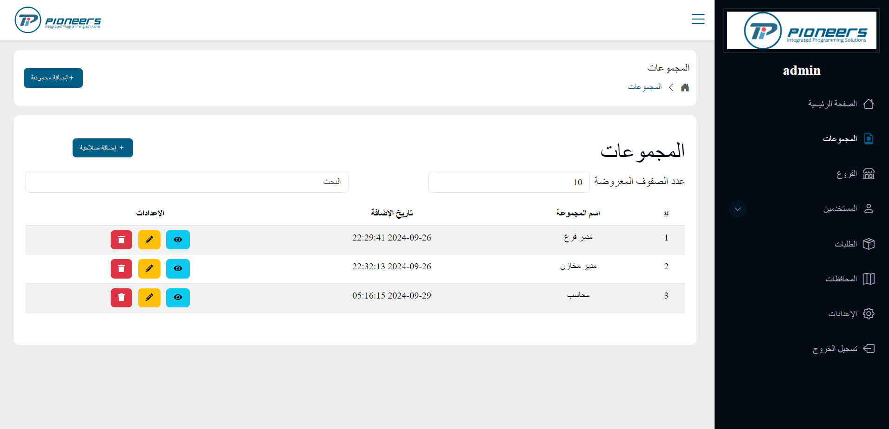
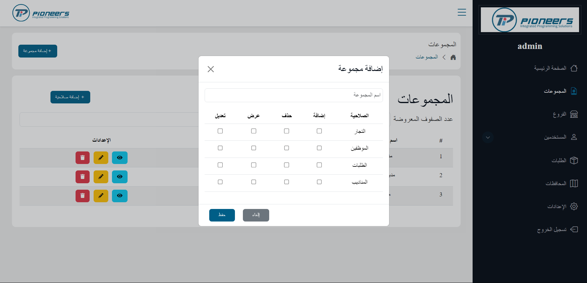
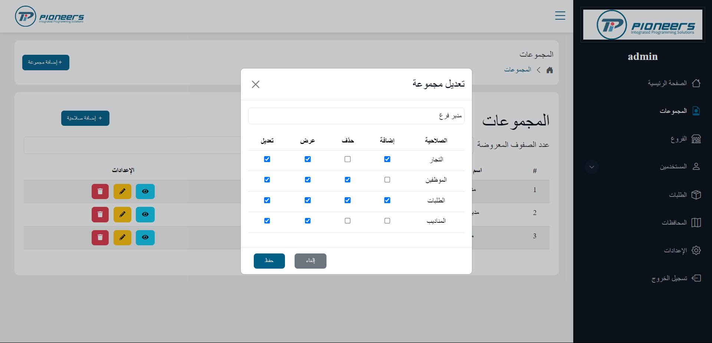
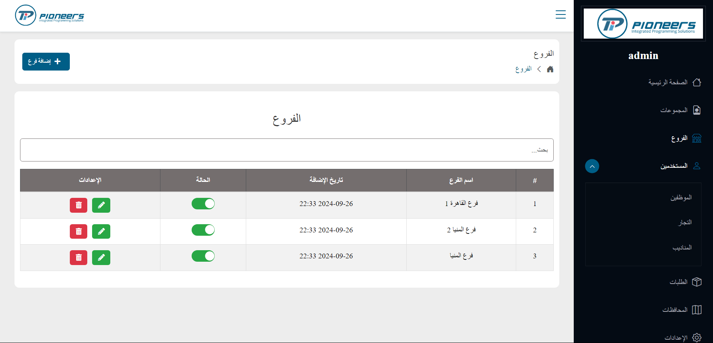
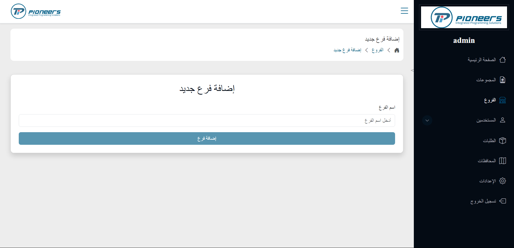
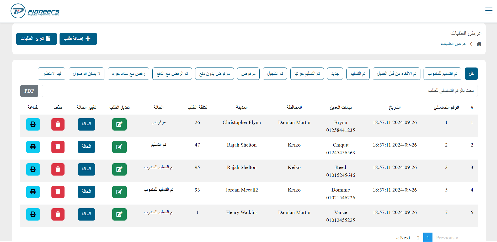

# Shipping Management System

This project was our [team's](#team-members) graduation project from **(Full-Stack Web Development using .NET and angular)** 4-months Intensive Code Camp in the [Information and Technology Institute](https://iti.gov.eg/home) **(ITI)**,Menofia branch.

The Shipping Management System developed is designed to streamline and automate the shipping process for logistics companies. It offers comprehensive features for managing user roles, permissions, orders, and geographical areas, catering to the needs of different user types such as administrators, employees, agents, and merchants.

**_Key Functionalities:_**

- User Management: Secure login for all users, with administrators able to manage accounts and assign role-based permissions.

- Order Management: Merchants can create orders, and employees can manage and track them, with reporting capabilities for analysis.

- Region and Branch Management: Manage shipping operations across branches and geographical areas, ensuring accurate routing.

- Weight Settings: Configure weight options for shipments, enabling accurate cost calculations.

- Dashboards: Tailored dashboards for different user roles, enhancing ease of use and access to relevant features.

[**Go To the backend repository**](https://github.com/loaisaber07/Shipping-Management)

## Table of Contents

- [Features](#features)
- [Technologies Used](#technologies-used)
- [Angular Features Used](#angular-features-used)
- [Future Improvements](#to-be-added)
- [Team](#team-members)
- [Screenshots](#screenshots)

## Features

**1. User Authentication**

- Admin logs in with a username and password.
- Other users (employees, agents, merchants) log in with a username/email and password.

**2. User Management**

- Add Users: Admin can add users by entering the full name, username, email, and password.
- Edit/Delete Users: Admin can edit or permanently delete users.
- Assign Groups: Admin can assign users to predefined user groups (with specific permissions).

**3. User Groups and Permissions**

- Admin can create groups of users and assign permissions for accessing or modifying screens and functionalities within the system.
- Permissions define the operations and screens a user group can access.

**4. Weight Settings**

- Provides screens for managing weight settings, which may include adjusting weight options for shipping.

**5. Region Management**

- Branches: Manage the branches used for shipping.
- Areas: Includes screens to manage geographical regions such as cities and provinces.

**6. Order Management**

- Add Orders (Merchant): Merchants can add shipping orders to the system.
- View Orders (Employee): Employees can view and manage orders.
- Order Reports: Employees can generate reports on the orders.

**7. Main Dashboards**

- Merchant Dashboard: Specific dashboard with relevant features for merchants.
- Employee Dashboard: Specific dashboard for employees to manage shipping processes.

**8. Reports**

- Allows employees to generate order reports for analysis and tracking.

**9. Non-Functional Requirements**

- Data Accuracy: Ensuring the data is accurate throughout the system.
- Performance: Optimizing the speed of data loading.
- Data Security: Encrypting user data to ensure privacy and protection.

## Technologies Used

- **Angular V18.1.4**
- **Bootstrap 5**
- **HTML5**
- **CSS3**
- **TypeScript**
- **Git**

## Angular Features Used

The Angular framework offers numerous features that simplify development, improve code maintainability, and enhance the overall quality of the final product. Below are the key features leveraged in this project:

- **Standalone Components:** In this project, we used `standalone components` instead of traditional Angular modules. This allows each component to define its dependencies and simplifies the architecture by reducing the complexity of the module system. Standalone components make it easier to manage and optimize dependencies at the component level.

- **Angular Services:** Services facilitate reusable logic for data management and backend interaction. In this project, services were implemented to handle business logic and communicate with backend APIs efficiently. Shared services also allow seamless data sharing between different components while following the `Dependency Injection pattern`.

- **Angular Routing:** Angular’s powerful routing mechanism was used to navigate between different views of the application. To optimize performance, **_lazy loading_** was implemented, which loads components on demand, reducing the initial load time and improving user experience.

- **Angular Guards:** Route guards (such as `AuthGuard`) were utilized to secure application routes, ensuring that only authorized users can access specific pages. These guards also help manage roles and permissions, enhancing overall security.

- **Angular Interceptors:** HTTP interceptors were employed to handle API requests, automatically attaching the `JWT token` to authorized requests. Interceptors also manage global behaviors, such as displaying a loading spinner during API calls and handling error responses from the backend.

- **TypeScript Interfaces:** Strong typing through TypeScript interfaces ensured better alignment between front-end and back-end data models. This helped reduce errors, especially when handling complex `Data Transfer Objects (DTOs)` received from the backend.

- **Angular Reactive Forms:** Reactive forms were implemented to create dynamic and complex forms with built-in validation. This enabled seamless form control, validation, and error handling, providing a smooth user experience for input-heavy sections of the application.

- **Pipes:** Custom and built-in Angular pipes were used to transform data in templates. For example, date formatting, string manipulation, and conditional filtering were handled using pipes, keeping the templates clean and concise.

- **Angular Directives:** directives were used to extend the behavior of HTML elements in a reusable way. For example, directives were used to handle specific DOM manipulations and UI behaviors.

- **Performance Optimization:** Techniques such as trackBy in `*ngFor` were applied to optimize performance by minimizing unnecessary re-renders.

## Future Improvements

- **Real-Time order Tracking** (GPS & notifications)
- **Advanced Analytics** (data insights & custom reports)
- **Automated Order Assignment** (smart dispatching & load optimization)
- **Third-Party Integration** (payment gateways, e-commerce platforms)
- **Predictive Analysis** (delivery time, cost optimization)
- **Enhanced Security** (2FA, audit logs)
- **Mobile Application** (for employees, merchants, and customers)
- **Multilingual & Multi-Currency Support**
- **Warehouse Management Integration** (inventory tracking, automation)
- **Customer Feedback System** (ratings & feedback collection)

## Team Members

- [Loai Saber](https://github.com/loaisaber07)
- [Ahmed Kamel](https://github.com/AKR045)
- [Mohamed Adel](https://github.com/mohamedadel26)
- [Ahmed Yaseer](https://github.com/Ahmedyasser11)
- [Mohamed Sakr](https://github.com/sakr2000)

## ScreenShots

